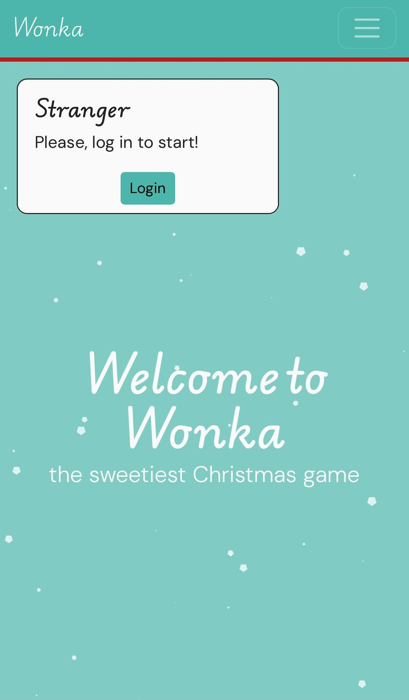
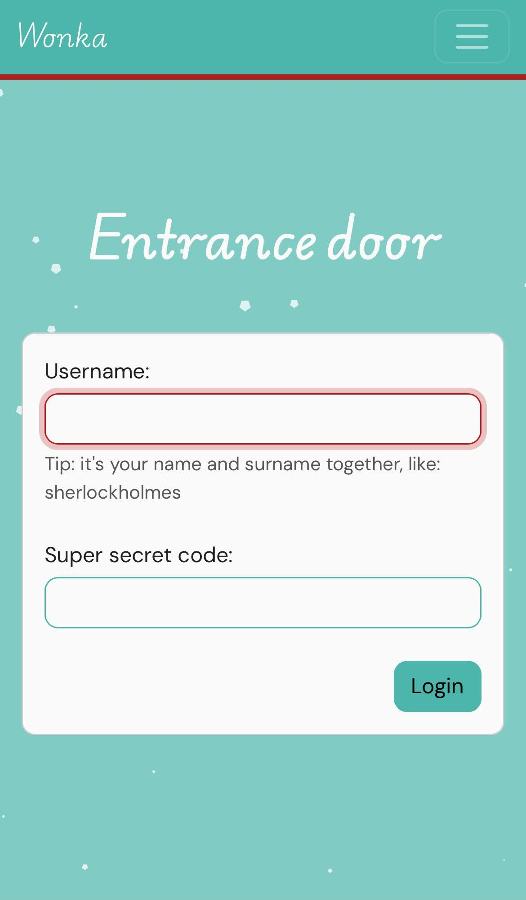
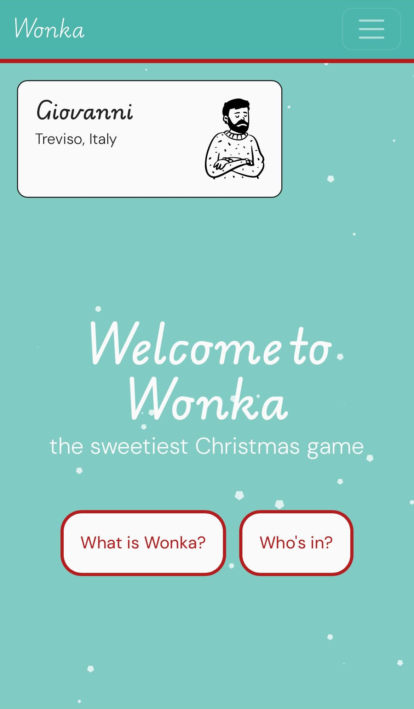
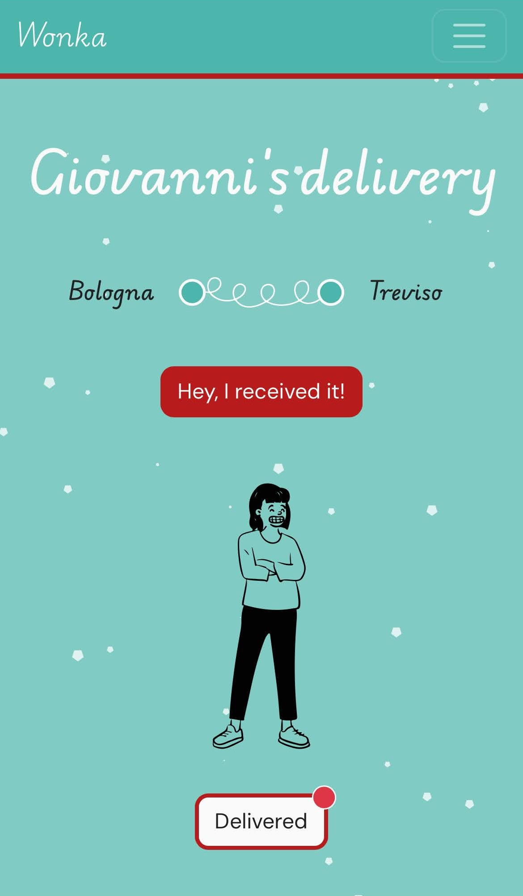

### Wonka: the sweetiest Christmas game &nbsp;
*December 2024*

For Christmas, I created a surprise game for my friends, inspired by the classic golden ticket from *Charlie and the Chocolate Factory*. I mailed each of them a chocolate bar — but only one lucky bar had a golden ticket hidden inside.\
To add some interactivity, I built a little website where they could track their chocolate deliveries, mark when they’d received them, and ultimately find out who found the golden ticket.\

`Tools`: Python (Django), HTML, CSS (Bootstrap), Adobe Illustrator.\
`Source code`&nbsp; [](https://github.com/giorgia-dit/friendly-game)

::: {layout="[[25,25,25,25], [100]]"}
{width=300}

{width=300}

{width=300}

{width=300}

{fig-align="center" width=400}
:::

&nbsp;

### Paperplanes &nbsp;
I am a co(n)founder of this small beauty-spreading project.\    
[Paperplanes](https://t.me/via_paperplanes) is a social media channel sharing hidden, beautiful contents, each matched with an open question.

It helped me improve project management and team building skills, as well as the ability to fit creativity into deadlines.

&nbsp;

### jordi lou &nbsp;
Music is my way to blow off steam.

I enjoy both listening and playing. I used to write only for myself, but eventually I started working on my first releases, published under the name *jordi lou*. \

<iframe style="border-radius:12px" src="https://open.spotify.com/embed/artist/1nSDSmSE8lSE5QVeyzF9dq?utm_source=generator&theme=0" width="100%" height="352" frameBorder="0" allowfullscreen="" allow="autoplay; clipboard-write; encrypted-media; fullscreen; picture-in-picture" loading="lazy"></iframe>